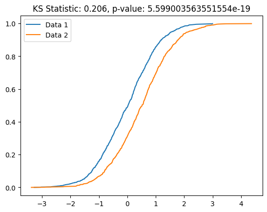
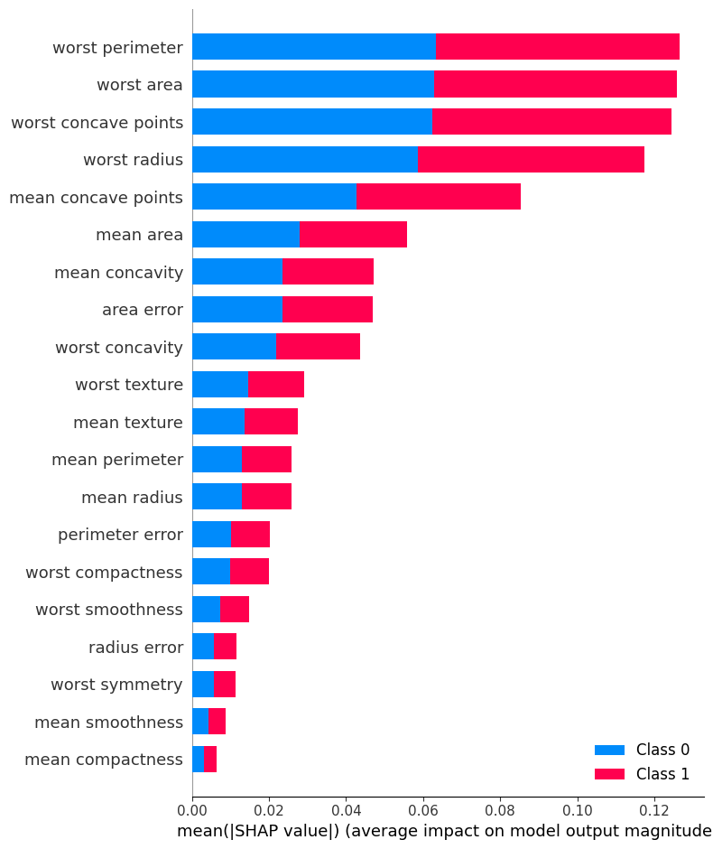
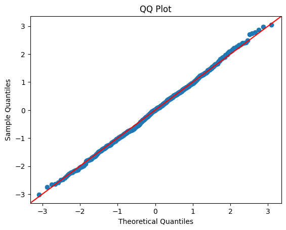
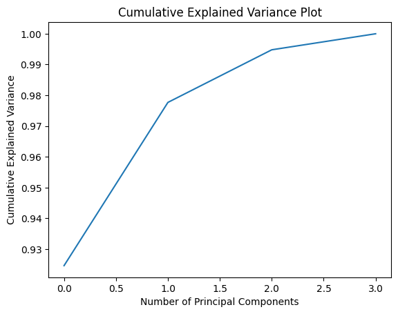
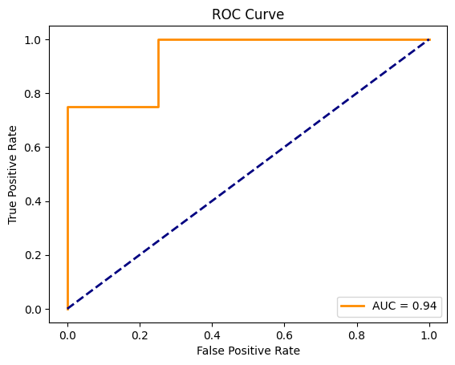
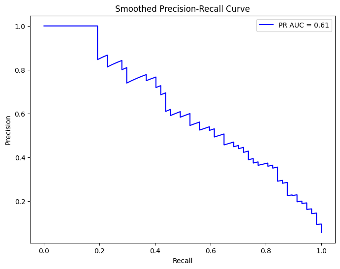
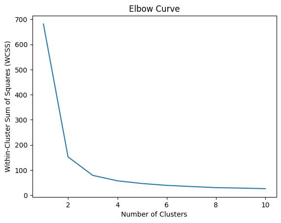

# Useful Data Science Plots

This is a collection of plots that I have found useful for data science. This list will be continuoulsy updated.

## Table of Contents

- [Kolmogorov-Smirnov Plot](#kolmogorov-smirnov-plot)
- [SHAP Plot](#shap-plot)
- [QQ Plot](#qq-plot)
- [Cumulative Explained Variance Plot](#cumulative-explained-variance-plot)
- [ROC Curve](#roc-curve)
- [Precision-Recall Curve](#precision-recall-curve)
- [Elbow Curve](#elbow-curve)


## Kolmogorov-Smirnov Plot

### Use Case

Compare the cumulative distributions of two datasets. It is often employed to test whether a sample is drawn from a particular distribution.

### How it Works

Plots the cumulative distribution functions of two datasets and visually compares them.

### Example
```python
import numpy as np
import matplotlib.pyplot as plt
from scipy.stats import ks_2samp

# Example data
data1 = np.random.normal(0, 1, 1000)
data2 = np.random.normal(0.5, 1, 1000)

# KS test
ks_statistic, ks_p_value = ks_2samp(data1, data2)

# KS plot
plt.plot(np.sort(data1), np.linspace(0, 1, len(data1), endpoint=False), label='Data 1')
plt.plot(np.sort(data2), np.linspace(0, 1, len(data2), endpoint=False), label='Data 2')
plt.title(f'KS Statistic: {ks_statistic}, p-value: {ks_p_value}')
plt.legend()
plt.show()
```


## SHAP Plot

### Use Case

Used to understand the impact of each feature on a model's output (feature importance).

### How it Works

SHAP (SHapely Additive exPlanations) values quanitify the contributions of each feature to the prediction for a specific instance.

### Example

```python
import shap
import matplotlib.pyplot as plt
from sklearn.ensemble import RandomForestClassifier
from sklearn.datasets import load_breast_cancer

# Example data
data = load_breast_cancer()
X, y = data.data, data.target

# Train a model
model = RandomForestClassifier()
model.fit(X, y)

# SHAP values
explainer = shap.TreeExplainer(model)
shap_values = explainer.shap_values(X)

# Summary plot
shap.summary_plot(shap_values, X, feature_names=data.feature_names)
```


## QQ Plot

### Use Case

Used to assess whether a dataset follows a particular theoretical distribution (e.g., normal distribution).

### How it Works

Compares the quantiles of the observed data against the quantiles of the theoretical distribution.

### Example

```python
import numpy as np
import statsmodels.api as sm
import matplotlib.pyplot as plt

# Example data
data = np.random.normal(0, 1, 1000)

# QQ plot
sm.qqplot(data, line='45')
plt.title('QQ Plot')
plt.show()
```


## Cumulative Explained Variance Plot

### Use Case

Used in principal component analysis to visualize the cumulative explained variance by each principal component.

### How it Works

Shows the cumulative proportion of variance explained by each principal component.

### Example

```python
import numpy as np
import matplotlib.pyplot as plt
from sklearn.decomposition import PCA
from sklearn.datasets import load_iris

# Example data
data = load_iris()
X = data.data

# PCA
pca = PCA()
pca.fit(X)

# Cumulative explained variance plot
plt.plot(np.cumsum(pca.explained_variance_ratio_))
plt.xlabel('Number of Principal Components')
plt.ylabel('Cumulative Explained Variance')
plt.title('Cumulative Explained Variance Plot')
plt.show()
```


## ROC Curve

### Use Case

Used to evaluate the performance of a binary classification model across different threshold settings.

### How it Works

Plots the true positive rate (sensitivity) against the false positive rate (1 - specificity). 

### Example

```python
from sklearn.metrics import roc_curve, auc
import matplotlib.pyplot as plt

# Example data
y_true = [0, 1, 1, 0, 1, 0, 1, 0]
y_scores = [0.1, 0.4, 0.7, 0.2, 0.8, 0.3, 0.9, 0.5]

# Compute ROC curve and AUC
fpr, tpr, _ = roc_curve(y_true, y_scores)
roc_auc = auc(fpr, tpr)

# Plot ROC curve
plt.plot(fpr, tpr, color='darkorange', lw=2, label=f'AUC = {roc_auc:.2f}')
plt.plot([0, 1], [0, 1], color='navy', lw=2, linestyle='--')
plt.xlabel('False Positive Rate')
plt.ylabel('True Positive Rate')
plt.title('ROC Curve')
plt.legend(loc='lower right')
plt.show()
```


## Precision-Recall Curve

### Use Case

Used to evaluate the performance of a binary classification model, especially when dealing with imbalanced datasets.

### How it Works

Plots precision against recall for different threshold settings.

### Example

```python
import numpy as np
import matplotlib.pyplot as plt
from sklearn.datasets import make_classification
from sklearn.model_selection import train_test_split
from sklearn.linear_model import LogisticRegression
from sklearn.metrics import precision_recall_curve, auc

# Create a synthetic imbalanced dataset
X, y = make_classification(
    n_samples=5000, n_features=50, n_classes=2, weights=[0.95, 0.05], random_state=42
)

# Split the dataset into training and testing sets
X_train, X_test, y_train, y_test = train_test_split(
    X, y, test_size=0.2, random_state=42
)

# Train a logistic regression model with a stronger regularization
model = LogisticRegression(C=0.01)
model.fit(X_train, y_train)

# Make predictions on the test set
y_scores = model.predict_proba(X_test)[:, 1]

# Compute a precision-recall curve
precision, recall, _ = precision_recall_curve(y_test, y_scores, pos_label=1)
pr_auc = auc(recall, precision)

# Plot the precision-recall curve
plt.figure(figsize=(8, 6))
plt.plot(recall, precision, label=f"PR AUC = {pr_auc:.2f}", color="b")
plt.xlabel("Recall")
plt.ylabel("Precision")
plt.title("Smoothed Precision-Recall Curve")
plt.legend()
plt.show()
```


## Elbow Curve

### Use Case

Used in clustering to determine the optimal number of clusters (*k*).

### How it Works

Plots the within-cluster sum of squares (or other metrics) for different values of *k*.

### Example

```python
from sklearn.cluster import KMeans
import matplotlib.pyplot as plt
from sklearn.datasets import load_iris

# Example data
iris = load_iris()
X = iris.data

# Elbow curve
wcss = []
for i in range(1, 11):
    kmeans = KMeans(
        n_clusters=i, init="k-means++", max_iter=300, n_init=10, random_state=0
    )
    kmeans.fit(X)
    wcss.append(kmeans.inertia_)

# Plot elbow curve
plt.plot(range(1, 11), wcss)
plt.xlabel("Number of Clusters")
plt.ylabel("Within-Cluster Sum of Squares (WCSS)")
plt.title("Elbow Curve")
plt.show()
```


