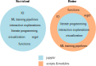

# Notes on *Good Research Code Handbook*

The good research code handbook is written by Patrick Mineault and can be viewed [here](https://goodresearch.dev).

This is my abridged version of the handbook and a reference point for me if I need one (though the goal is for all of this to be second-nature). The sections of notes will follow the sections in the book.

*The following ideas are not my own. Rather, they are those of Patrick Mineault. If an idea is my own, it will be denoted with a dagger, †.*

## Table of Contents

- [Notes on *Good Research Code Handbook*](#notes-on-good-research-code-handbook)
  - [Table of Contents](#table-of-contents)
  - [Setting up your project](#setting-up-your-project)
    - [Pick a name and create a folder for your project](#pick-a-name-and-create-a-folder-for-your-project)
    - [Initialize a git repository and sync to GitHub](#initialize-a-git-repository-and-sync-to-github)
    - [Set up a virtual environment](#set-up-a-virtual-environment)
      - [Conda](#conda)
      - [Pip and venv](#pip-and-venv)
      - [Conda versus pip](#conda-versus-pip)
    - [Create a project skeleton](#create-a-project-skeleton)
      - [`data/`](#data)
      - [`docs/`](#docs)
      - [`results/`](#results)
      - [`scripts/`](#scripts)
      - [`src/`](#src)
      - [`tests/`](#tests)
      - [`.gitignore`](#gitignore)
      - [`README.md`](#readmemd)
      - [`environment.yml` (or `requirements.txt`)](#environmentyml-or-requirementstxt)
    - [Install a project package](#install-a-project-package)
      - [Create a pip-installable package](#create-a-pip-installable-package)
      - [Alternative to pip-installable packages](#alternative-to-pip-installable-packages)
    - [Using the true-neutral cookiecutter](#using-the-true-neutral-cookiecutter)
  - [Keep things tidy](#keep-things-tidy)
    - [Use the style guide](#use-the-style-guide)
      - [PEP 8](#pep-8)
      - [Delete dead code](#delete-dead-code)
      - [Keep Jupyter notebooks tidy](#keep-jupyter-notebooks-tidy)
  - [Write decoupled code](#write-decoupled-code)
    - [Code smells and spaghetti code](#code-smells-and-spaghetti-code)
    - [Making code better](#making-code-better)
      - [Separate concerns](#separate-concerns)
      - [Use pure functions](#use-pure-functions)
      - [Avoid side effects](#avoid-side-effects)
  - [Testing your code](#testing-your-code)
    - [Lightweight formal tests with `assert`](#lightweight-formal-tests-with-assert)
      - [Examples](#examples)
    - [Testing with a test suite](#testing-with-a-test-suite)
    - [A hierarchy of tests](#a-hierarchy-of-tests)
  - [Write good documentation](#write-good-documentation)
    - [Raise errors](#raise-errors)
    - [Type hints](#type-hints)
    - [Write docstrings](#write-docstrings)
    - [Publish docs on Readthedocs](#publish-docs-on-readthedocs)
  - [Document your project](#document-your-project)
    - [Write console programs](#write-console-programs)
    - [Document pipelines](#document-pipelines)
      - [Commit shell files](#commit-shell-files)
      - [Document pipelines with make](#document-pipelines-with-make)
      - [Record the provenance of each figure and table](#record-the-provenance-of-each-figure-and-table)
    - [Document projects](#document-projects)
      - [Write a `README.md` file](#write-a-readmemd-file)
      - [Write Markdown docs](#write-markdown-docs)
  - [Make coding social](#make-coding-social)
    - [Pair program](#pair-program)
    - [Set up code review in your lab](#set-up-code-review-in-your-lab)

<div style="page-break-after: always;"></div>

## Setting up your project

The broad steps to setting up an organized project are

1. Pick a name and create a folder for your project
2. Initialize a git repository and sync to GitHub*
3. Set up a virtual environment
4. Create a project skeleton
5. Install a project package 

\*† I tend to find it easier to create a git repository, clone it locally (`git clone https://<repo_url>`), and then proceed. This takes care  of the first step, as well.

### Pick a name and create a folder for your project

 - Default structure of: **one project == one folder == one repository**.
   - Don't be afraid to create standalone projects for tools that are re-used across projects.
 - Make project names short and descriptive.
   - † Use snake_case naming conventions for project names (assuming a Python project.)
 - `mkdir project_name`

### Initialize a git repository and sync to GitHub

```bash
$ echo "# Project Name" >> README.md
$ git init
$ git add README.md
$ git commit -m "First commit -- adds README"
$ git branch -M main
$ git remote add origin https://<repo_url>
$ git push -u origin main
```

 - Commit to git regularly throughout the course of the project.
 - Commits should be logically grouped.

### Set up a virtual environment

 - Virtual environment manage dependencies.
   - Specifics of which versions of software and packages are in use are contained by a virtual environment.
     - These specifics can be easily swapped, created, duplicated, or destroyed.
 - Software that can be used ot manage dependencies includes
   - `conda`
   - `pipenv`
   - `poetry`
   - `venv`
   - `virtualenv`
   - `asdf`
   - `docker`
   - and more.
     - This is a matter of preference

#### Conda

Below is how to set up a Conda package manager environment.

**Creating and activating an environment**

```bash
~/project_name$ conda create --name project_name python=3.12
~/project_name$ conda activate project_name
```

**Installing packages**

```bash
(project_name) ~/project_name$ conda install pandas numpy scipy matplotlib seaborn
```

**Export your environment**

```bash
(project_name) ~/project_name$ conda env export > environment.yml
```

Then, you may consider committing this environment file:

```bash
~/project_name$ git add environment.yml
~/project_name$ git commit environment.yml -m "Adds conda environment file"
~/project_name$ git push
```

This file can then be used to recreate this environment:

```bash
$ conda env create --name recoveredenv --file environment.yml
```

*Note that this will only work for the same operating system. It will not be portable to a different operating system. This is due to it documenting low-level, OS-specific packages. Manually adjust the file to account for this if portability is necessary.*

**Add dependencies to your environment**

```bash
(project_name) ~/project_name$ conda env update --prefix ./env --file environment.yml --prune
```

#### Pip and venv

**Creating and activating an environment:**

```bash
~/project_name$ python -m venv project_name-env
~/project_name$ source project_name-env/bin/activate
```

**Installing packages**

```bash
(project_name-env) ~/project_name$ pip install pandas numpy scipy matplotlib seaborn
```

**Export your environment**

```bash
(project_name-env) ~/project_name$ pip freeze > requirements.txt
```

Then, you may consider committing this requirements file:

```bash
~/project_name$ git add requirements.txt
~/project_name$ git commit requirements.txt -m "Adds pip requirements file"
~/project_name$ git push
```

This file can then be used to recreate this environment:

```bash
$ python -m venv recovered-env
$ source recovered-env/bin/activate
(recovered-env) $ pip install -r requirements.txt
```

*Note the requirements.txt file does not distinguish between packages installed via pip or other package managers. If non-Python dependencies need to be documented separately, consider using additional tools or documentation.*

#### Conda versus pip

> You can use pip inside of a conda environment. A big point of confusion is how conda relates to pip. For conda:
> • Conda is both a package manager and a virtual environment manager
> • Conda can install big, complicated-to-install, non-Python software, like gcc 
> • Not all Python packages can be installed through conda
>
> For pip:
> • pip is just a package manager
> • pip only installs Python packages
> • pip can install every package on PyPI in addition to local packages
>
> Conda tracks which packages are pip installed and will include a special section in `environment.yml` for pip packages. However, installing pip packages may negatively affect conda’s ability to install conda packages correctly after the first pip install. Therefore, people generally recommend installing big conda packages first, then installing small pip packages second.


### Create a project skeleton

There is not a default standard for a Python project. The following is as good as any but feel free to tweak it to specific needs:

```
.
├── data/
├── docs/
├── results/
├── scripts/
├── src/
├── tests/
├── .gitignore
├── environment.yml (or requirements.txt)
└── README.md
```

```bash
$ mkdir {data, docs, results, scripts, src, tests}
```

#### `data/`

A place for raw data. This doesn't typically get added to source control unless the datasets are small.

#### `docs/`

Where documentation goes. Naming it `docs` makes publishing it through, say, GitHub pages, easier.

#### `results/`

Where you put test results including checkpoints, hdf5 files, pickle files, as well as figures and tables. If files are large don't add to source control.

#### `scripts/`

Python and bash scripts, Jupyter notebooks, etc.

#### `src/`

Reusable Python modules for the project. Code you would consider `import`ing.

#### `tests/`

Where tests for your code go.

#### `.gitignore`

A list of files that git should ignore.

#### `README.md`

A description of your project, including installation instructions. What people will see on the top level of the repository.

#### `environment.yml` (or `requirements.txt`)

Description of your environment.

### Install a project package

*This will make the project pip installable.*

#### Create a pip-installable package

The steps for creating a locally pip installable package only involves a few steps:

1. **Create a `setup.py` file**
   ```python
   from setuptools import find_packages, setup

   setup (
    name='src',
    packages=find_packages()
   )
   ```
   This should be done in the root (top level) of your project.
2. **Create an `__init__.py` file**
   1. This goes in the `src` directory.
   2. It is empty.
   3. It allows `find_packages` to find the package.
   ```bash
   ~/project_name$ touch src/__init__.py
   ```
3. **`pip install` your package**
   ```bash
   (env) ~/project_name$ pip install -e .
   ```
   1. `.` indicates the package is being installed in the current directory.
   2. `-e` indicates the package should be editable.
      1. This way, if you change the files inside the `src` folder you don't need to re-install the package for your changes to be picked up by Python.
4. **Use the package**
   1. Once the package is locally installed it can be easily used *regardless of which directory you're in*.
   2. Example
        ```bash
        (env) ~/project_name$ echo "print('hello world')" > src/hello_world.py
        (env) ~/project_name$ cd scripts
        (env) ~/project_name$ python
        >>> import src.hello_world
        hello world
        >>> exit()
        (env) ~/project_name$ cd ~
        (env) ~/project_name$ python
        >>> import src.helloworld
        hello world
        ```
5. **(optional) Change the name of the package**
   1. To change from `src` to, say, `project_name`, simply
        ```bash
        (env) ~/project_name$ mv src project_name
        ```
   2. If changes aren't automatically picked up, do
        ```bash
        (env) ~/project_name$ pip install -e .
        ``` 

#### Alternative to pip-installable packages

This is a shortcut to make your code accessible to other files in different directories but is not the most future-proof method. 

By adding the `src` folder to your Python path you should be able to access the code anywhere:

```python
import sys

sys.path.append('~/project_name/src')

from src.lib import cool_function
```

### Using the true-neutral cookiecutter

You can skip everything we just went over using the `cookiecutter` tool.

As an example to do exactly what we did (there are other `cookiecutter` flavors, including the robust [Data Science `cookiecutter`](https://drivendata.github.io/cookiecutter-data-science/#directory-structure)):

```bash
(env) ~/project_name$ pip install cookiecutter
(env) ~/project_name$ cookiecutter gh:patrickmineault/true-neutral-cookiecutter
```
<div style="page-break-after: always;"></div>

## Keep things tidy

### Use the style guide

 - Snake case for variables and modules: `variable_name`, `cool_module.py`
 - Camel case for class name: `CoolClass`   
 - Camel case with spaces for Jupyter notebook: `Cool Jupyter Notebook.ipynb`

#### PEP 8

You could study the style guide. Or you could consider using a linter and/or a code formatter, such as

- `flake8` (linter)
- `pylint` (linter)
- `black` (code formatter)
- `ruff` (linter and code formatter; † personal favorite)

#### Delete dead code

Simply clean up dead code, at least from the main branch. Consider using [Vulture](https://github.com/jendrikseipp/vulture) if there is a lot of dead code.

#### Keep Jupyter notebooks tidy

This photo from the book adequatley summarizes a good Jupyter approach.



Additionally, you should

 - Make sure notebooks run top to bottom without errors.
   - Ideally, in a minute or less.
 - Be productive mixing modules and notebooks
   - To ensure a module is automatically reloaded in Jupyter whenever the module is changed, add these two magics:
      ```python
      %load_ext autoreload
      %autoreload 2
      ```
 - Refactor comfortably
   - Move imports and function definitions to the top of your notebook.
   - Delete cells with obsolete analyses from the bottom of the notebook.
   - † If you want the notebook checked into Git consider moving it to the [percent format](https://jupytext.readthedocs.io/en/latest/formats-scripts.html#the-percent-format).
      ```bash
      (env) ~/project_name$ pip install jupytext
      (env) ~/project_name$ jupytext --set-formats ipynb,percent notebook.ipynb
      ```
<div style="page-break-after: always;"></div>

## Write decoupled code

### Code smells and spaghetti code

Code smells shoudl be avoided and include:

 - Mysterious names
   - Variables have names which don't indicate their function.
 - Magic numbers
   - Unique values with unexplained meaning.
 - Duplicated code
   - Large portions of duplicated code with small tweaks.
 - Uncontrolled side effects and variable mutations
   - Code is written so that it's unclear where and when variables are changed.
 - Large functions
   - Big, unwieldy functions that do a little bit of everything.
 - High cyclomatic complexity
   - Lots of nested ifs and for loops
 - Globals
   - Using globals for things that don't strictly need to be global
 - Embedded configuration
   - Paths and filenames are hardcoded in ways that the code is not portable to another computer.

*Spaghetti code* == code so tightly wound that when you pull on one strand, the entire thing unravels.

### Making code better

#### Separate concerns

 - A function does one thing.
   - *Make small functions!*
 - A module assembles functions which all work towards the same goal.
 - A class mostly modifies its own members rather than other objects.

#### Use pure functions

Pure functions follow the canonical data flow:

 - the inputs come from the arguments
 - the outputs are returned with the `return` statement

and are considered stateless and deterministic. They are easy to reason about. 

#### Avoid side effects

A side effect is anything that happens outside the canonical data flow from arguments to return, including

 - Modifying a global variable.
 - Modifying a static local variable.
 - Modifying an argument.
 - Doing I/O, including printting to the console, drawing on the screen, or calling a remote server.

> Not every function with side effects is problematic, however.

To have well-behaved side effects,

 - Write functions which modify their arguments OR return values, but not both.
 - Concentrate your I/O in their own functions rather than sprinkling them throughout the code.
 - Use classes to encapsulate state rather than using stateful functions and globals.
   - Python classes use the convention that private variables, which shouldn't be modified from outside, start with an `_`.
     - For example, `self._x` denotes a class member `_x` which should be managed by the class itself.
  
<div style="page-break-after: always;"></div>

## Testing your code

### Lightweight formal tests with `assert`

† *Good for notebooks!*

`assert` throws an error whenever the statement is false.

#### Examples

**a.**

```python
>>> assert 1 == 0
```
```
Traceback (most recent call last):
  File "<stdin>", line 1, in <module> 
AssertionError
```
**b.**

```python
def fib(x):
  if x <= 2:
    return 1 
  else:
    return fib(x-1) + fib(x-2)

if __name__ == ’__main__’: assert fib(0) == 0
  assert fib(1) == 1
  assert fib(2) == 1
  assert fib(6) == 8
  assert fib(40) == 102334155
  print("Tests passed")
```

```bash
$ python fib.py
Traceback (most recent call last):
  File "fib.py", line 8, in <module> assert fib(0) == 0
AssertionError
```

### Testing with a test suite

Once you have a lot of tests it makes sense to group them into a test suite that gets run with a test runner. You can use `pytest` or `unittest`. The book focuses on the more common `pytest`.

This is most easily shown through example:

After installing `pytest` by running `pip install -U pytest`, create a file in `tests/` called `test_fib.py` that looks like:

```python
from src.fib import fib
import pytest

def test_typical():
  assert fib(1) == 1
  assert fib(2) == 1
  assert fib(6) == 8
  assert fib(40) == 102334155

def test_edge_case():
  assert fib(0) == 0

def test_raises():
  with pytest.raises(NotImplementedError):  # checks that this error is raised
    fib(-1)
  with pytest.raises(NotImplementedError):
    fib(1.5)
```

Then, run the test suite:

```
$ pytest test_fib.py
...
  def fib_inner(x): 
    nonlocal cache 
      if x in cache:
        return cache[x]
>     if x == 0:
E     RecursionError: maximum recursion depth exceeded in comparison

../src/fib.py:7: RecursionError
============================= short test summary info ========================== FAILED test_fib.py::test_raises-RecursionError: maximum recursion depth exceed =========================== 1 failed, 2 passed in 1.18s ========================
```

At this point the code can be fixed, the test suite ran again, and an output like 

```
test_fib.py ...                                                           [100%] 
================================ 3 passed in 0.02s =============================
```

is seen.

### A hierarchy of tests

There are more types of tests than just unit tests:

- *Static tests*: your editor parses and runs your code as you write it to figure out if it will crash       
- *Inline asserts*: test whether intermediate computations are as expected
- *Unit tests*: test whether one function or unit of code works as expected
- *Docstring tests*: unit tests embedded in docstrings
- *Integration tests*: test whether multiple functions work correctly together
- *Smoke tests*: test whether a large piece of code crashes at an intermediate stage
- *Regression tests*: tests whether your code is producing the same outputs that it used to in previous versions
- *End-to-end tests*: literally a robot clicking buttons to figure out if your application works as expected

<div style="page-break-after: always;"></div>

## Write good documentation

> For many people, *documenting code* is synonymous with *commenting code*. That's a narrow view of documentation.

### Raise errors

Raise errors in your code so that you know they will get read -- docstrings often aren't. Some common and generic errors to consider mixing in are `NotImplementedError`, `ValueError`, and `NameError`. You can also mix in the aforementioned `asserts` to make a block of code fail more gracefully if, for example, an input isn't the correct format.

### Type hints

Optionally-enforced type checking using decorators. These are a matter of preference (and to some Python purists are sacreligious) but they do increase documentation.

### Write docstrings

The three prevailing styles of docstrings are reST, Google, and NumPy. Pick one and stick to it (along with your colleagues). IDEs can parse and display these docstrings, which tends to be very helpful.

> Docstrings can age poorly. When your arguments change, it’s easy to forget to change the docstring accordingly. I prefer to wait until later in the development process when function interfaces are stable to start writing docstrings.

### Publish docs on Readthedocs

Generating docs is easy with Sphinx:

```bash
pip install sphinx
cd docs
sphinx -quickstart
make html
```

You can then publish your docs to Readthedocs by linking your repository. You can, of course, publish to other places as well, such as GitHub pages or netlify.

> Sphinx by default works for reST docstrings. It can also work for Google and NumPy docstrings with a plugin.

<div style="page-break-after: always;"></div>

## Document your project

### Write console programs

Instead of commenting and un-commenting code, we can have different code paths execute depending on flags passed as command line arguments. 

`argparse` makes this easy. Here is an example of a use of `argparse`: 

```python
import argparse 

def main(args):
  # TODO: Implement a neural net here. 
  print(args.model) # Prints the model type.

if __name__ == ’__main__’:
  parser = argparse.ArgumentParser(description="Train a neural net")
  parser.add_argument(" --model", required=True, help="Model type (resnet or alexnet)")
  parser.add_argument(" --niter", type=int, default=1000, help="Number of iterations")
  parser.add_argument(" --in_dir", required=True, help="Input directory with images")
  parser.add_argument(" --out_dir", required=True, help="Output directory with trained model")
  
  args = parser.parse_args()
  main(args)
```

```bash

$ python train_net.py -h
usage: train_net.py [ -h] --model MODEL [ --niter NITER] --in_dir IN_DIR --out_dir
OUT_DIR

Train a neural net

optional arguments:
-h, --help
--model MODEL
--niter NITER
--in_dir IN_DIR
--out_dir OUT_DIR Output directory with trained model
```

### Document pipelines

#### Commit shell files

Once code is taking configuration as command line flags, a record of the flags that you used when you invoke your code should be kept. An easy way to do this is a shell file that contains multiple shell commands that are run one after the other.

Here is an example shell file. Notice that it not only runs the code but it is also documentation of the pipeline:

```shell

#!/bin/bash
# This will cause bash to stop executing the script if there’s an error
set -e

# Download files
aws s3 cp s3://codebook -testbucket/images/ data/images --recursive

# Train network
python scripts/train_net.py --model resnet --niter 100000 --in_dir data/images \
  --out_dir results/trained_model

# Create output directory
mkdir results/figures/

# Generate plots
python scripts/generate_plots.py --in_dir data/images \
  --out_dir results/figures/ --ckpt results/trained_model/model.ckpt
```

#### Document pipelines with make

There are a lot of make options out there. Consider adding them as your pipeline grows. A makefile specifies both the inputs to each pipeline step and its outputs.

† I have personally worked with and like `snakemake` for machine-learning projects.

#### Record the provenance of each figure and table

Here is a nice shortcut to having figures and tables versioned with your codebase:

```python

import git
import matplotlib.pyplot as plt

repo = git.Repo(search_parent_directories=True)
short_hash = repo.head.object.hexsha[:10]

# Plotting code goes here...
plt.savefig(f’figure.{short_hash}.png’)
```

This reduces ambiguity about how and when this figure was generated. The same can be done with any other type of results file.

There are other, more full-featured tools that can do this in a much more robust fashion if that better meets your needs. For example, consider Wandb, Neptune, Gigantum, or datalad, to name a few.

### Document projects

#### Write a `README.md` file

At minimum, consider including

 - A one-sentence description of your project
 - A longer description of your project
 - Installation instructions
 - General orientation to the codebase and usage instructions • Links to papers
 - Links to extended docs 
 - License

and keep the filel up-to-date.

#### Write Markdown docs

Writing notes in Markdown allows them to be extended to a wide variety of platforms for other's ingestion. It tends to vary by environment on just how much you need to document, but it saves yourself future work to write in Markdown.

<div style="page-break-after: always;"></div>

## Make coding social

### Pair program

An effective method of sharng knowledge through active practice -- two programmers collaborate actively on a programming task. Traditionally, there is a driver, who physically types the code and thinks about micro-issues in teh code (tactics), and the navigator, who assists the driver in telling them what to write and focus on macro issues e.g., what a function should accomplish.

### Set up code review in your lab

† I think code reviews are essential for a team to work well.

Code review is the practice of peer reviewing other people's code. Common ways to do this are through pull/merge requests. Alternatively, a code review meeting can be organized where everyone reads code and comments on it at once. 

---

This is the end of the document. I hope you found, and continue to find, it helpful.
